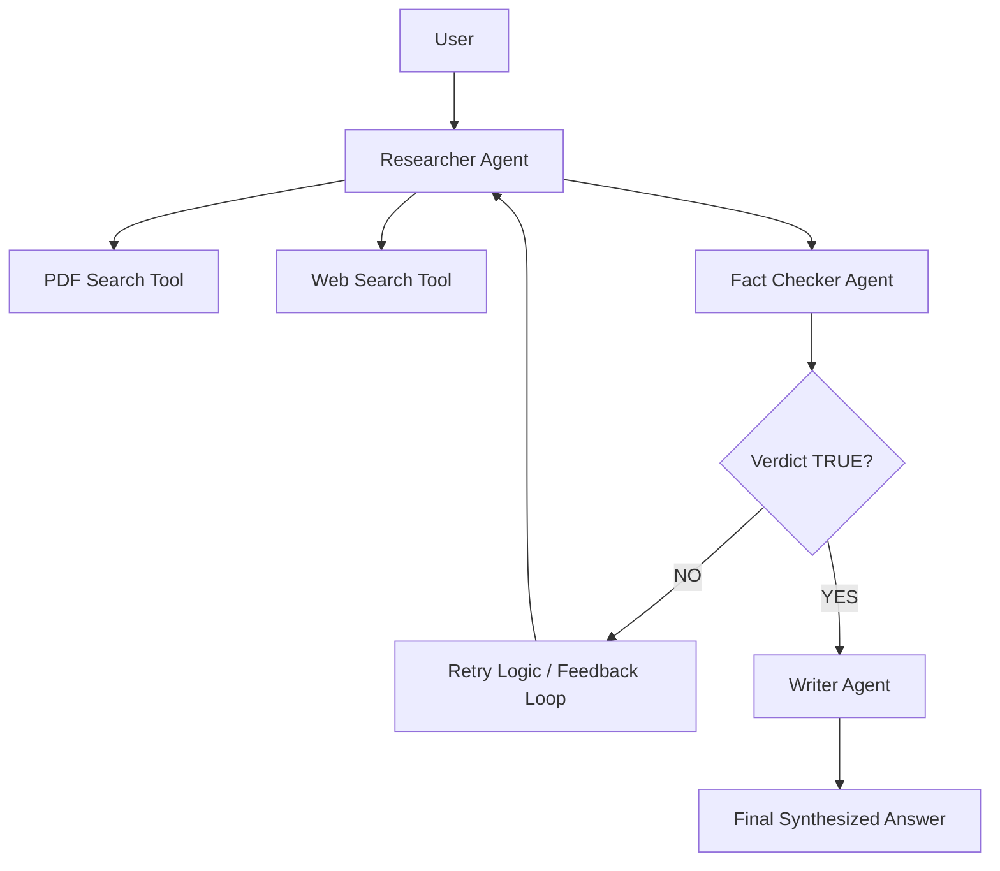

# Agentic RAG Framework


A multi-agent, self-correcting Retrieval-Augmented Generation (RAG) framework built using CrewAI and LangChain. This project implements an advanced research pipeline where dedicated agents collaborate to gather information from semantic PDF stores and the web, perform fact-checking against gathered context, and iteratively refine answers based on objective quality verdicts.

## Table of Contents
- [Tech Stack & Architecture](#tech-stack--architecture)
- [Prerequisites](#prerequisites)
- [Installation & Local Setup](#installation--local-setup)
- [Usage & Running the App](#usage--running-the-app)
- [Testing](#testing)
- [Deployment](#deployment)
- [Contributing Guidelines](#contributing-guidelines)
- [License and Contact](#license-and-contact)

## Tech Stack & Architecture

### Core Technologies
- **Orchestration**: `CrewAI` (Multi-agent process management)
- **Foundation Models**: `Google Gemini` (via LangChain)
- **Vector Store**: `ChromaDB` (Local persistence for semantic search)
- **Search Capabilities**: `Tavily` (For real-time web research)
- **Parsing**: `PyPDF` and `sentence-transformers` for PDF ingestion

### High-Level Architecture
The system utilizes a sequential process flow with a built-in feedback loop:



1. **Researcher Agent**: Analyzes the query and intelligently selects between local PDF context or global web data.
2. **Fact Checker Agent**: Rigorously validates the accuracy of the research against provided context.
3. **Writer Agent**: Transforms verified technical research into a clean, user-friendly response.

## Prerequisites
- **Python**: Version 3.13+ mandated by `pyproject.toml`.
- **uv**: Recommended for high-performance dependency management.
- **External API Keys**: 
  - `GOOGLE_API_KEY`: Required for Gemini model access.
  - `TAVILY_API_KEY`: Required for web search capabilities.

## Installation & Local Setup

```bash
git clone https://github.com/The-Vaibhav-Yadav/Basic-Agentic-RAG.git
cd Basic-Agentic-RAG
uv sync
```

### Environment Variables
Create a `.env` file in the root directory:
```bash
cp .env.example .env
```
Ensure the following variables are defined:
- `GOOGLE_API_KEY`
- `TAVILY_API_KEY`
- `OTEL_SDK_DISABLED=true` (Optional: disables OpenTelemetry if not needed)

## Usage & Running the App

### Starting the Research Pipeline
Invoke the main execution script to start the agentic loop:
```bash
uv run python main.py
```
By default, the system will process the PDF context provided (e.g., `attention_is_all_you_need.pdf`) and search for information if the local context is insufficient.

- **Status Monitoring**: Real-time agent collaboration and tool usage logs are visible in the terminal.
- **Final Output**: The writer's final synthesized response is returned once the Fact Checker provides a `TRUE` verdict.

## Testing
Unit evaluations for agent logic and tool integration:
- **Command**: `pytest`
- **Focus**: Validates vector store lookups and agent tool-calling consistency.

## Deployment
This framework is container-ready. Utilize the included `pyproject.toml` to build a Dockerized image capturing all agent orchestration logic for deployment as an internal API service.

## Contributing Guidelines
1. Fork the repository.
2. Create a specific feature branch (`git checkout -b feature/agent-optimization`).
3. Follow **Conventional Commits**: `feat: add retry persistence logic`.
4. Ensure all code passes `ruff` linting if introduced.

## License and Contact
- **License**: MIT
- **Contact**: Vaibhav Yadav (https://github.com/The-Vaibhav-Yadav)
